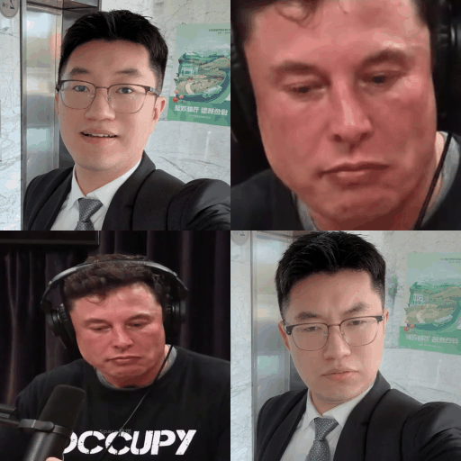

## 💡 About This Fork

This project is a reproduction of [GVCLab/PersonaLive](https://github.com/GVCLab/PersonaLive) with the following enhancements:

- **Lower VRAM Requirement**: Optimized to run on **8GB VRAM** GPUs (originally required 12GB+)
- **Chunk-based Inference**: Added `--chunk` parameter for long video generation, splitting videos into manageable chunks to avoid OOM errors
- **Memory-efficient Streaming**: Improved memory management for generating videos with 1000+ frames on consumer GPUs

<div align="center">

</div>


### Usage

```bash
# Standard mode (for short videos, L <= 300)
python inference_offline.py -L 300 --reference_image ref.jpg --driving_video drive.mp4 --name test

# Chunk mode (for long videos, L > 300, runs on 8GB VRAM)
python inference_offline.py -L 1000 --reference_image ref.jpg --driving_video drive.mp4 --name test --chunk

# Custom chunk size
python inference_offline.py -L 1000 --reference_image ref.jpg --driving_video drive.mp4 --name test --chunk --chunk_size 200
```

## 🚀 Getting Started
### 🛠 Installation
```
# clone this repo
git clone https://github.com/GVCLab/PersonaLive
cd PersonaLive

# Create conda environment
conda create -n personalive python=3.10
conda activate personalive

# Install packages with pip
pip install -r requirements_base.txt
```

### ⏬ Download weights
Option 1: Download pre-trained weights of base models and other components ([sd-image-variations-diffusers](https://huggingface.co/lambdalabs/sd-image-variations-diffusers) and [sd-vae-ft-mse](https://huggingface.co/stabilityai/sd-vae-ft-mse)). You can run the following command to download weights automatically:
    
```bash
python tools/download_weights.py
```

Option 2: Download pre-trained weights into the `./pretrained_weights` folder from one of the below URLs:
    
<a href='https://drive.google.com/drive/folders/1GOhDBKIeowkMpBnKhGB8jgEhJt_--vbT?usp=drive_link'></a> <a href='https://pan.baidu.com/s/1DCv4NvUy_z7Gj2xCGqRMkQ?pwd=gj64'></a> <a href='https://modelscope.cn/models/huaichang/PersonaLive'></a> <a href='https://huggingface.co/huaichang/PersonaLive'></a>

Finally, these weights should be organized as follows:
```
pretrained_weights
├── onnx
│   ├── unet_opt
│   │   ├── unet_opt.onnx
│   │   └── unet_opt.onnx.data
│   └── unet
├── personalive
│   ├── denoising_unet.pth
│   ├── motion_encoder.pth
│   ├── motion_extractor.pth
│   ├── pose_guider.pth
│   ├── reference_unet.pth
│   └── temporal_module.pth
├── sd-vae-ft-mse
│   ├── diffusion_pytorch_model.bin
│   └── config.json
├── sd-image-variations-diffusers
│   ├── image_encoder
│   │   ├── pytorch_model.bin
│   │   └── config.json
│   ├── unet
│   │   ├── diffusion_pytorch_model.bin
│   │   └── config.json
│   └── model_index.json
└── tensorrt
    └── unet_work.engine
```

### 🎞️ Offline Inference
Run offline inference with the default configuration:

```
python inference_offline.py
```

* `-L`: Max number of frames to generate. (Default: 100)
* `--use_xformers`: Enable xFormers memory efficient attention. (Default: True)
* `--stream_gen`: Enable streaming generation strategy. (Default: True)
* `--reference_image`: Path to a specific reference image. Overrides settings in config.
* `--driving_video`: Path to a specific driving video. Overrides settings in config.

⚠️ Note for RTX 50-Series (Blackwell) Users: xformers is not yet fully compatible with the new architecture. To avoid crashes, please disable it by running:

```
python inference_offline.py --use_xformers False
```

### 📸 Online Inference
#### 📦 Setup Web UI
```
# install Node.js 18+
curl -o- https://raw.githubusercontent.com/nvm-sh/nvm/v0.39.1/install.sh | bash
nvm install 18

source web_start.sh
```

#### 🏎️ Acceleration (Optional)
Converting the model to TensorRT can significantly speed up inference (~ 2x ⚡️). Building the engine may take about `20 minutes` depending on your device. Note that TensorRT optimizations may lead to slight variations or a small drop in output quality.
```
# Install packages with pip
pip install -r requirements_trt.txt

# src/models/motion_encoder/FAN_temporal_feature_extractor.py
self.pos_embed.pos_embed.requires_grad = False

# Converting the model to TensorRT
python torch2trt.py
```
💡 **PyCUDA Installation Issues**: If you encounter a "Failed to build wheel for pycuda" error during the installation above, please follow these steps:
```
# Install PyCUDA manually using Conda (avoids compilation issues):
conda install -c conda-forge pycuda "numpy<2.0"

# Open requirements_trt.txt and comment out or remove the line "pycuda==2024.1.2"

# Install other packages with pip
pip install -r requirements_trt.txt

# Converting the model to TensorRT
python torch2trt.py
```
⚠️ The provided TensorRT model is from an `H100`. We recommend `ALL users` (including H100 users) re-run `python torch2trt.py` locally to ensure best compatibility.

#### ▶️ Start Streaming
```
python inference_online.py --acceleration none (for RTX 50-Series) or xformers or tensorrt
```
Then open `http://0.0.0.0:7860` in your browser. (*If `http://0.0.0.0:7860` does not work well, try `http://localhost:7860`)


## 🚄 Model Training

PersonaLive training is organized into three stages. Approximate training time on 8x H100 with default configs: Stage 1 ~13h, Stage 2 ~15h, Stage 3 ~20h.

### 1️⃣ Environment setup
Install base dependencies first (see installation section), then install training-only packages:

```bash
pip install -r requirements_train.txt
```

If you use multi-GPU or multi-node training, configure Accelerate once before launching training:

```bash
accelerate config
```

### 2️⃣ Data preparation
Your dataset should contain a `videos` directory and a matching `boxes` directory:

```text
Datasets
├── VFHQ
│   ├── videos
│   │   ├── example1.mp4
│   │   ├── example2.mp4
│   │   └── ...
│   └── boxes
│       ├── example1.pt
│       ├── example2.pt
│       └── ...
└── ...
```

Preprocessing example:

```bash
# 1) Extract face / eye / mouth boxes from each frame
python tools/get_boxes.py --video_dir ./Datasets/VFHQ/videos --save_dir ./Datasets/VFHQ/boxes --workers 8

# 2) Generate meta json: [{"video_path": ".../videos/xxx.mp4"}, ...]
python tools/extract_meta_info.py --root_path ./Datasets/VFHQ --dataset_name VFHQ
```

Then set `data.meta_paths` in each training config:

```yaml
data:
  meta_paths:
    - "./data/VFHQ_meta.json"
    - "./data/OtherDataset_meta.json"
```
